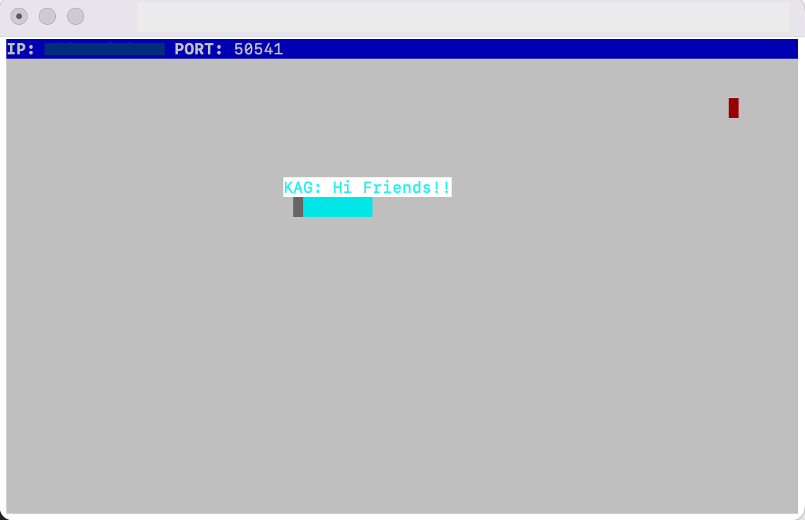

# snake-client

A take on the original Snake game where the player manoeuvres a dot and grows it by ‘eating’ pieces of food. As it moves and eats, it grows and the growing snake becomes an obstacle to smooth manoeuvres. 

The goal is to grow the snake to become as long as possible without bumping into the side walls, or bumping into itself, upon which it dies.

This version of the game is multiplayer.

## Screenshot

## Commands

First you will need to connect to the server in one terminal. Then connect your client in a separate terminal by running: `node play.js`

`node play.js <initals>`: start the game. Include player initals as argument, I.e. KAG

`w`: Move the snake up

`a`: Move left

`s`: Move down

`d`: Move right

`m`: Greeting to players

`n`: Silly message to players

`b`: Bye message to players

`q`: Quit Game

`CTRL+C`: Quit the game
